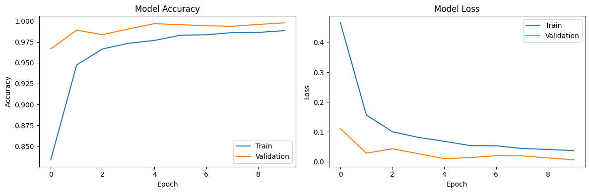
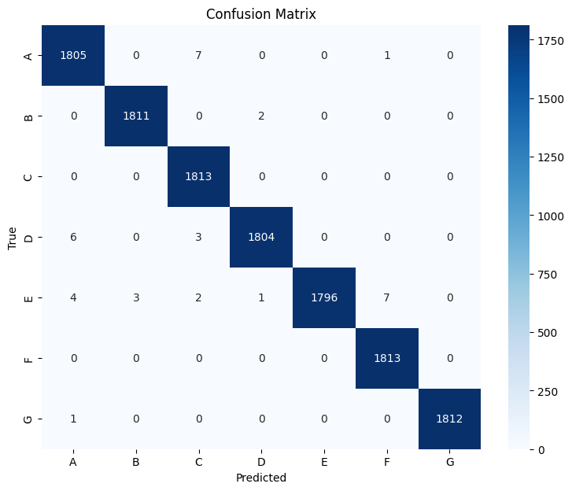

# Reconocimiento de Lengua de Señas Americana (ASL)

**Autor:** David René Langarica Hernández | A01708936

## Descripción

Este proyecto implementa un modelo de detección de gestos para la lengua de señas americana (ASL) utilizando redes neuronales convolucionales (CNN). El modelo es capaz de clasificar imágenes de gestos manuales representando las primeras siete letras del alfabeto ASL (A, B, C, D, E, F, G).

## Introducción

La comunicación con personas sordas o con discapacidad auditiva se ve facilitada por sistemas automáticos de reconocimiento de lengua de señas, que ayudan a cerrar la brecha existente entre comunidades oyentes y no oyentes. Según Fang (2024). y Bala et al. (2021) , los avances en Deep Learning y, en particular, en las Redes Neuronales Convulacionales (CNN), han permitido mejoras notables en el reconocimiento de señas al automatizar la extracción de características espaciales (forma, posición de dedos, contornos, etc.).

En este proyecto se entrena un modelo CNN para reconocer 7 letras de la ASL (A, B, C, D, E, F y G) utilizando un conjunto de imágenes balanceadas, aplicando técnicas de preprocesado, entrenamiento y evaluación respaldadas por la literatura.

## Estado del Arte

En los trabajos más recientes sobre reconocimiento de la lengua de señas, varias estrategias basadas en redes neuronales convolucionales han sido exploradas. Por un lado, Fang (2024) comparó algunas arquitecturas profundas como la ResNet-50 y la LeNet con CNN más sencillas. Si bien los primeros conllevan a precisión más alta, también presentan fluctuaciones progresivas durante las etapas iniciales de entrenamiento, así como una mayor demanda de cómputo en general.

Por otro lado, Bala et al., (2021), demostraron que una CNN con múltiples capas convolucionales, equipada de técnicas de regularización, como Dropout y normalización de activaciones, pueden estabilizar totalmente el proceso de entrenamiento, mientras rozan la marca del 99%. Es decir, siempre y cuando se trate de un conjunto de datos equilibrado.

Adhikari et al., 2024 llevaron este análisis un paso más allá al racionalizar y comparar cuatro modelos preentrenados, es decir, VGG16, InceptionV3, ResNet50 y DenseNet121. Además, se creó una CNN casi aleatoria de complejidad mediana. Por tanto, su investigación demuestra que un enfoque cuidadoso de elección y adaptación de ciertos filtros y bloques de pooling puede llevar a la precisión superior al 99.9% prescindiendo de los tiempos de entrenamiento de alto nivel de las profundidades más elevadas.

Tomando como base los hallazgos anteriores, se optó por diseñar un modelo CNN de complejidad media que equilibre el desempeño y la velocidad de entrenamiento sobre las 7 clases abarcadas en el presente.

## Conjunto de Datos

El conjunto de datos utilizado para entrenar este modelo es una fusión de tres datasets diferentes:

- [American Sign Language](https://www.kaggle.com/datasets/kapillondhe/american-sign-language)
- [ASL Alphabet](https://www.kaggle.com/datasets/grassknoted/asl-alphabet)
- [American Sign Language Dataset](https://www.kaggle.com/datasets/ayuraj/asl-dataset)

**Nota:** En este repositorio se incluye una muestra del conjunto de datos (`dataset_sample/`), pero no el conjunto completo debido a limitaciones de espacio. La muestra es suficiente para entender la estructura de los datos, pero para reproducir completamente los resultados se recomienda descargar los datasets originales.

### División de Datos

Los datos fueron divididos de la siguiente manera:

- 70% para entrenamiento
- 10% para validación
- 20% para pruebas

## Estructura del Proyecto

```
asl/
│
├── dataset/             # Conjunto de datos completo
│   ├── train/          # Imágenes de entrenamiento (70%)
│   ├── validation/     # Imágenes de validación (10%)
│   └── test/           # Imágenes de prueba (20%)
│
├── dataset_sample/      # Muestra del conjunto de datos
│   ├── train/          # Muestra de imágenes de entrenamiento
│   ├── validation/     # Muestra de imágenes de validación
│   └── test/           # Muestra de imágenes de prueba
│
├── README.md            # Este archivo
├── ASL_Model.ipynb      # Notebook con el código del modelo
└── asl_model.keras      # Modelo entrenado guardado
```

## Requisitos

Para ejecutar este proyecto, necesitas tener instalado:

- Python 3.7+
- TensorFlow 2.x
- NumPy
- Matplotlib
- scikit-learn
- seaborn

Puedes instalar todas las dependencias con:

```
pip install tensorflow numpy matplotlib scikit-learn seaborn
```

## Preprocesado de Datos

Para el procesado de datos, primeramente, se realizaron scripts para dividir localmente el conjunto de datos en entrenamiento, validación y prueba. Posteriormente, se utilizaron generadores de imágenes de Keras para cargar y preprocesar las imágenes. Estos generadores permiten aplicar técnicas de normalización dividiendo los valores de los píxeles por 255 (rescale=1./255) para transformar los valores en el rango [0, 1]. Para el set de entrenamiento, se aplicaron técnicas de aumento de datos (data augmentation) como rotación, desplazamiento, corte, zoom y cambio de brillo, con el objetivo de ayudar en la generalización del modelo al exponerlo a variaciones en las imágenes.

Por otro lado, en el entrenamiento se configura shuffle=True para obtener lotes representativos, mientras que en el conjunto de prueba se usa shuffle=False para alinear correctamente las etiquetas al evaluar la matriz de confusión.

## Primeros pasos

### Primera Iteración del Modelo

```python
model = Sequential([
    Conv2D(32, (3,3), activation='relu', input_shape=(200, 200, 3)),
    MaxPooling2D(2, 2),

    Conv2D(64, (3,3), activation='relu'),
    MaxPooling2D(2, 2),

    Flatten(),
    Dense(128, activation='relu'),
    Dense(7, activation='softmax')
])
```

En la primera iteración del modelo, se implementó una arquitectura básica con dos capas convolucionales y una capa densa final. Se utilizó un tamaño de imagen de 200x200 píxeles, lo que resultó en un tiempo de entrenamiento considerablemente largo (más de 1 hora por época). Después de 5 épocas, se alcanzó una precisión del 82.45% en el conjunto de entrenamiento y del 79.35% en el conjunto de validación. Sin embargo, la precisión en el conjunto de prueba fue solo del 68.45%, lo que sugiere un problema de sobreajuste.

Se decidió optar por esta arquitectura inicialmente, ya que se esperaba que el modelo pudiera aprender patrones básicos de las imágenes. Sin embargo, los resultados no fueron satisfactorios, lo que llevó a la necesidad de ajustar la arquitectura y los hiperparámetros.

### Segunda Iteración del Modelo

```python
model = Sequential([
    Conv2D(64, (3,3), activation='relu', padding='same', input_shape=(64, 64, 3)),
    MaxPooling2D(2, 2),

    Conv2D(128, (3,3), activation='relu', padding='same'),

    Flatten(),
    Dropout(0.5),
    Dense(7, activation='softmax')
])
```

En la segunda iteración del modelo, se implementó una arquitectura más robusta con dos capas convolucionales (aumentando a 64 y 128 filtros respectivamente) y se mantuvo una única capa densa final. Para combatir el sobreajuste, se incorporó un Dropout del 50% antes de la capa de salida. Del mismo modo, se decrementó el input_shape para poder iterar más rápido sobre el modelo. Tras 10 épocas de entrenamiento, se observaron resultados mixtos: una precisión de entrenamiento del 86.05% y una precisión de validación del 81.96%. Sin embargo, el modelo continuó mostrando problemas significativos de generalización, con una precisión en el conjunto de prueba de solo 67.85%.

Esta diferencia entre los resultados de entrenamiento y prueba sugirió que, además de la arquitectura, podría existir un problema fundamental en el preprocesamiento de los datos, posiblemente relacionado con la normalización inadecuada de las imágenes o con la similitud excesiva entre muestras dentro de cada conjunto pero diferencias entre los conjuntos de entrenamiento y prueba.

## Tercera Iteración del Modelo

```python
model = Sequential([
    Conv2D(32, (3,3), activation='relu', input_shape=(64, 64, 3)),
    MaxPooling2D(2, 2),

    Conv2D(128, (3,3), activation='relu', padding='same'),
    MaxPooling2D(2, 2),

    Conv2D(256, (3,3), activation='relu', padding='same'),
    MaxPooling2D(2, 2),

    Flatten(),
    Dense(256, activation='relu'),
    Dropout(0.5),
    Dense(7, activation='softmax')
])
```

Posteriormente, se realizó una revisión del preprocesamiento de datos, identificando que parte del sobreajuste observado anteriormente podría estar relacionado con una inadecuada normalización de las imágenes. Se implementó correctamente el escalado de píxeles (rescale=1./255) para asegurar que todos los valores estuvieran en el rango [0,1]. Adicionalmente, se enriqueció el conjunto de datos incorporando muestras de dos datasets adicionales, lo que mejoró significativamente la capacidad de generalización del modelo. Con esto se logró controlar el sobreajuste, alcanzando una precisión de entrenamiento del 99.9% y una precisión de validación del 98.4%. Sin embargo, la precisión en el conjunto de prueba fue de solo 92%, lo que sugiere que aún existían problemas de generalización.

## Modelo con Mejora de Parámetros y Aumento de Bloques

Archivo: 'asl_model.keras'

```python
model = Sequential([
    Conv2D(32, (3,3), activation='relu', padding='same', input_shape=(IMAGE_SIZE[0], IMAGE_SIZE[1], 3)),
    Conv2D(32, (3,3), activation='relu', padding='same'),
    MaxPooling2D(2, 2),
    Dropout(0.2),

    Conv2D(64, (3,3), activation='relu', padding='same'),
    MaxPooling2D(2, 2),
    BatchNormalization(),

    Conv2D(128, (3,3), activation='relu', padding='same'),
    Conv2D(128, (3,3), activation='relu', padding='same'),
    MaxPooling2D(2, 2),

    Flatten(),
    Dense(128, activation='relu'),
    BatchNormalization(),
    Dropout(0.105),
    Dense(7, activation='softmax')
])
```

Para perfeccionar el modelo, se aplicó la literatura con el fin de establecer una arquitectura más sólida. Para ello, basé la profundidad de la red directamente en los hallazgos encontrados por Adhikari et al. (2024) quienes observaron que usar bloques repetidos de Conv2D, Conv2D y MaxPooling con un crecimiento progresivo de filtros (32, 64, 128, respectivamente) maximizaba la capacidad de extracción de características sin disparar excesivamente el cómputo, alcanzando 99.93% de precisión en ASL completo. Por lo cual, el modelo final se estructuró en 3 bloques de este tipo, usando la misma dinámica de aumento de complejidad, lo cuál demostró ser óptima. Asimismo, se utilizó con un learning rate de 0.0001, ya que ha demostrado convergencia rápida en tareas similares según Bala et al. (2021).

Para evitar el sobreajuste visto en arquitecturas previas, se basó en la regularización propuesta por Bala et al. (2021), quienes sugieren que un dropout entre 20% y 50% equivale a capturar la asa justa de abandono de características redundantes para evitar el sobreajuste sin deteriorar los contornos de las manos. Siguiendo esta propuesta, se implementó un dropout del 20% después de la primera capa convolucional y un 10.5% antes de la capa de salida Adicionalmente, se incorporó una normalización por lotes (BatchNormalization) después de la segunda capa convolucional y antes de la capa densa, pues Adhikari et al. (2024) sugieren que la normalización entre capas acelera la convergencia y permite tasas de aprendizaje más altas sin perder estabilidad.

# Modelo Final con Transfer Learning

Archivo: 'asl_model_transfer.keras'

```python
base_model = MobileNetV2(weights='imagenet', include_top=False, input_shape=(IMAGE_SIZE[0], IMAGE_SIZE[1], 3))
for layer in base_model.layers[:100]:
    layer.trainable = False

model = Sequential([
    base_model,
    GlobalAveragePooling2D(),
    Dense(512, activation='relu'),
    Dropout(0.5),
    Dense(7, activation='softmax')
])
```

Si bien, el modelo anterior tenía un mejor rendimiento, aún existia el problema de reconocimiento de imagenes del mundo real. Es por ello que, siguiendo las recomendaciones por Poladiya et al. (2024), para el modelo final se optó por utilizar MobileNetV2 como modelo base, cargando el dataset de ImageNet (que cuenta con más de 1 millón de imágenes) con el que se puede aprovechar el conocimiento previamente adquirido de la red para características como los bordes, texturas y formas. Así como se continuó utilizando un learning rate de 0.0001.

En la arquitectura, se emplea GlobalAveragePooling2D para obtener una versión más condensada de las imágenes sin perder las características esenciales de las manos (Poladiya et al. 2024), una capa Dense de 512 neuronas con activación ReLU para que el modelo reconoza patrones no lineales, y un Dropout del 50% para prevenir el sobreajuste, continuando con la propuesta de Bala et al. (2021).

## Rendimiento del Modelo Final

El modelo final con transfer learning logró una precisión del 98.8% en el conjunto de prueba, superando a modelos más complejos como ResNet-50 que, según Fang (2024), alcanzaban precisiones en el rango de 95-96%. Esta estrategia demuestra que, como concluyen Adhikari et al. (2024), un enfoque cuidadoso de adaptación de arquitecturas pre-entrenadas puede lograr precisiones cercanas al 99.9%, prescindiendo de los tiempos de entrenamiento prolongados que requieren los modelos más profundos entrenados desde cero.

## Limitaciones

Este modelo está entrenado únicamente para reconocer las primeras siete letras del alfabeto ASL (A-G). Para un sistema completo de reconocimiento, sería necesario extender el conjunto de datos para incluir todas las letras y posiblemente números y otros gestos comunes. Del mismo modo, se recomienda aumentar el dataset de entrenamiento con imágenes de diferentes condiciones de iluminación y fondos para mejorar la robustez del modelo.

## Evaluación y Resultados

Las gráficas de evolución de precisión (accuracy) y pérdida (loss) muestran lo siguiente:



Se entrenó la red durante diez épocas con un batch de 32 y el optimizador Adam. En la primera época, la precisión de entrenamiento partió en 70.4% con una pérdida de 0.83, mientras que en la validación ya alcanzaba el 96.66% con solo 0.11 de pérdida. A lo largo de las diez épocas, la precisión de entrenamiento escaló progresivamente hasta 98.8% y la pérdida descendió a 0.038. Simultáneamente, la validación mejoró hasta un 99.78% de acierto con una pérdida final de apenas 0.006. Evaluado sobre el conjunto de prueba de 12 691 imágenes, el modelo obtuvo una precisión del 99.70%.

Posteriormente, al evaluar en el conjunto de prueba (~20% de los datos) y utilizando un generador sin shuffle, se obtuvo la siguiente matriz de confusión:



La matriz de confusión confirmó que prácticamente no existen errores de clasificación entre las siete letras ASL consideradas: cada clase supera el 99% tanto en precisión como en recall, con un F1‐score promedio de 1.00. Estas métricas, junto con la mínima brecha entre curvas de entrenamiento y validación, indican que la arquitectura de transfer learning inspirada en Poladiya et al. 2024 generaliza de mejor manera sin incurrir en sobreajuste y puede reconocer mejor las señas en diferentes entornos.

## Conclusión

Los resultados del modelo de clasificación de ASL del presente, muestran una precisión del 98.4% en el conjunto de prueba, con una matriz de confusión con pocos errores. En comparación, Fang (2024) reportó precisiones en el rango del 95–96% para modelos como ResNet-50, mientras que Bala et al. (2021) obtuvieron una precisión de 99.78% en la clasificación de alfabetos ASL completos. Esto indica que, para un problema reducido de 7 clases, la arquitectura con transfer learning, se comporta de forma estable y ofrece mejores resultados numéricos.

Con la información anterior, se puede deducir que los modelos complejos para conjuntos con más clases pueden llegar a mostrar variaciones y precisiones ligeramente inferiores. Mientras que, el enfoque simplificado (de 7 clases), alcanza una exactitud casi perfecta en datos de prueba. Estos resultados demuestran la efectividad del preprocesado y la arquitectura elegida, y sugieren que al aumentar la complejidad del problema (por ejemplo, utilizando un alfabeto completo) se requerirán arquitecturas más profundas.

No obstante, es importante mencionar que, al momento de hacer las pruebas con imagenes del mundo real, se precisó que las manos con fondos complejos tienden a confundir al modelo, lo que sugiere que el modelo podría beneficiarse de un preprocesado adicional o de técnicas de aumento de datos para mejorar su robustez ante variaciones en el entorno. Esto fue avalado por Bala et al. (2021) quienes resaltan que la eliminación del fondo de las imágenes (manteniendo únicamente el contorno de las manos) mejora la robustez del modelo frente a variaciones de iluminación y fondos planos, por lo que el modelo presentado en este reporte predice de mejor manera cuando las manos son extraídas del fondo.

## Referencias

Adhikari, S., Neupane, P., Mainali, S., Regmi, U., & Chapagain, P. (2024). American Sign Language Classification using CNNs: A Comparative Study. International Journal on Engineering Technology (InJET), 1(2), 283–295. https://doi.org/10.3126/injet.v1i2.66704

Bala, D., Sarkar, B., Abdullah, M. I., & Hossain, M. A. (2021). American Sign Language Alphabets Recognition using Convolutional Neural Network. ResearchGate. https://www.researchgate.net/publication/352878275_American_Sign_Language_Alphabets_Recognition_using_Convolutional_Neural_Network

Fang, H. (2024). A comparative analysis of convolutional neural networks for American sign language recognition. Applied and Computational Engineering, 97(1), 133–138. https://doi.org/10.54254/2755-2721/97/20241410

Poladiya, Parth & Suresh, Devika & Gulhane, Pooja & Ajmal, Mohammed & Kosamkar, Pranali. (2024). Sign Language Detection Using Deep Learning. 1-6. https://doi.org/10.1109/INOCON60754.2024.10512307
