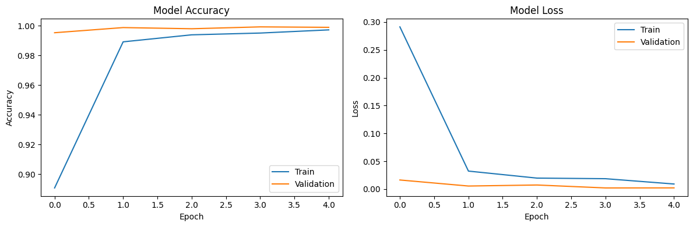

# Reconocimiento de Lengua de Señas Americana (ASL)

**Autor:** David René Langarica Hernández | A01708936

## Descripción

Este proyecto implementa un modelo de detección de gestos para la lengua de señas americana (ASL) utilizando redes neuronales convolucionales (CNN). El modelo es capaz de clasificar imágenes de gestos manuales representando las primeras siete letras del alfabeto ASL (A, B, C, D, E, F, G).

## Introducción

La comunicación con personas sordas o con discapacidad auditiva se ve facilitada por sistemas automáticos de reconocimiento de lengua de señas, que ayudan a cerrar la brecha existente entre comunidades oyentes y no oyentes. Según Fang (2024). y Bala et al. (2021) , los avances en Deep Learning y, en particular, en las Redes Neuronales Convulacionales (CNN), han permitido mejoras notables en el reconocimiento de señas al automatizar la extracción de características espaciales (forma, posición de dedos, contornos, etc.).

En este proyecto se entrena un modelo CNN para reconocer 7 letras de la ASL (A, B, C, D, E, F y G) utilizando un conjunto de imágenes balanceadas, aplicando técnicas de preprocesado, entrenamiento y evaluación respaldadas por la literatura.

## 2. Estado del Arte

En la literatura reciente se han propuesto varios enfoques para el reconocimiento de señas, con base en la investigación, se destacan los siguientes:

- **Comparative Analysis of CNN Architectures:**  
  Fang (2024) compara modelos como ResNet-50, LeNet y CNNs básicas para la detección de letras ASL, demostrando que las arquitecturas profundas pueden alcanzar precisiones mayores, aunque presenten fluctuaciones iniciales y requieran mayor potencia computacional.

- **CNN para Reconocimiento de Alfabetos ASL:**  
  Bala et al. (2021) entrenan una CNN con múltiples capas convolucionales y emplean técnicas de regularización (por ejemplo, Dropout y normalización), logrando una exactitud cercana al 99%. Del mismo modo, destacan la importancia de un dataset balanceado y la normalización para estabilizar el entrenamiento.

Tomando como base los dos trabajos anteriores, se optó por un modelo CNN de complejidad media que equilibre el desempeño y la velocidad de entrenamiento sobre las 7 clases abarcadas en el presente proyecto.

## Conjunto de Datos

El conjunto de datos utilizado para entrenar este modelo es una fusión de tres datasets diferentes:

- [American Sign Language](https://www.kaggle.com/datasets/kapillondhe/american-sign-language)
- [ASL Alphabet](https://www.kaggle.com/datasets/grassknoted/asl-alphabet)
- [American Sign Language Dataset](https://www.kaggle.com/datasets/ayuraj/asl-dataset)

**Nota:** En este repositorio se incluye una muestra del conjunto de datos (`dataset_sample/`), pero no el conjunto completo debido a limitaciones de espacio. La muestra es suficiente para entender la estructura de los datos, pero para reproducir completamente los resultados se recomienda descargar los datasets originales.

### División de Datos

Los datos fueron divididos de la siguiente manera:

- 70% para entrenamiento
- 10% para validación
- 20% para pruebas

## Estructura del Proyecto

```
asl/
│
├── dataset/             # Conjunto de datos completo
│   ├── train/          # Imágenes de entrenamiento (70%)
│   ├── validation/     # Imágenes de validación (10%)
│   └── test/           # Imágenes de prueba (20%)
│
├── dataset_sample/      # Muestra del conjunto de datos
│   ├── train/          # Muestra de imágenes de entrenamiento
│   ├── validation/     # Muestra de imágenes de validación
│   └── test/           # Muestra de imágenes de prueba
│
├── README.md            # Este archivo
├── ASL_Model.ipynb      # Notebook con el código del modelo
└── asl_model.keras      # Modelo entrenado guardado
```

## Requisitos

Para ejecutar este proyecto, necesitas tener instalado:

- Python 3.7+
- TensorFlow 2.x
- NumPy
- Matplotlib
- scikit-learn
- seaborn

Puedes instalar todas las dependencias con:

```
pip install tensorflow numpy matplotlib scikit-learn seaborn
```

## Preprocesado de Datos

Para el procesado de datos, primeramente, se utilizan técnicas de normalización dividiendo los valores de los píxeles por 255 (rescale=1./255) para transformar los valores en el rango [0, 1]. Por otro lado, en el entrenamiento se configura shuffle=True para obtener lotes representativos, mientras que en el conjunto de prueba se usa shuffle=False para alinear correctamente las etiquetas al evaluar la matriz de confusión.

## Modelo

Se implementó un modelo secuencial en TensorFlow/Keras con la siguiente configuración:

```python
model = Sequential([
    Conv2D(32, (3,3), activation='relu', input_shape=(64, 64, 3)),
    MaxPooling2D(2, 2),
    
    Conv2D(128, (3,3), activation='relu', padding='same'),
    MaxPooling2D(2, 2),
    
    Conv2D(256, (3,3), activation='relu', padding='same'),
    MaxPooling2D(2, 2),
    
    Flatten(),
    Dense(256, activation='relu'),
    Dropout(0.5),
    Dense(7, activation='softmax')
])
```

## Uso del Modelo

Para utilizar el modelo entrenado:

```python
from tensorflow.keras.models import load_model
import numpy as np
from tensorflow.keras.preprocessing.image import load_img, img_to_array

model = load_model('asl_model.keras')

def prepare_image(img_path):
    img = load_img(img_path, target_size=(64, 64))
    img_array = img_to_array(img)
    img_array = img_array / 255.0
    img_array = np.expand_dims(img_array, axis=0)
    return img_array

image = prepare_image('ruta/a/tu/imagen.jpg')
prediction = model.predict(image)
predicted_class = np.argmax(prediction, axis=1)[0]

class_names = ['A', 'B', 'C', 'D', 'E', 'F', 'G']
print(f"La letra predicha es: {class_names[predicted_class]}")
```

## Rendimiento del Modelo

El modelo alcanza una precisión de aproximadamente 99.9% en el conjunto de prueba, lo que indica un rendimiento excelente en la clasificación de las letras ASL incluidas en este proyecto.

## Evaluación y Resultados

Las gráficas de evolución de precisión (accuracy) y pérdida (loss) muestran lo siguiente:



    •	La precisión tanto en el entrenamiento como en la validación se acerca a 100%.
    •	Las pérdidas son muy bajas y estables.
    •	No se observa una brecha significativa entre el desempeño en entrenamiento y validación, lo que indica que el modelo se generaliza adecuadamente.

Posteriormente, al evaluar en el conjunto de prueba (~20% de los datos) y utilizando un generador sin shuffle, se obtuvo la siguiente matriz de confusión:


En donde cada fila representa la clase real y cada columna la predicha. De igual forma, los valores en la diagonal son prácticamente iguales al total de ejemplos por clase, lo que indica una buena clasificación. Por otro lado, se observan errores mínimos en las clases C, E y G (imágenes clasificadas incorrectamente).

## Conclusión

Los resultados del modelo de clasificación de ASL del presente, muestran una precisión del 99.91% en el conjunto de prueba, con una matriz de confusión con pocos errores. En comparación, Fang (2024) reportó precisiones en el rango del 95–96% para modelos como ResNet-50, mientras que Bala et al. (2021) obtuvieron una precisión de 99.78% en la clasificación de alfabetos ASL completos. Esto indica que, para un problema reducido de 7 clases, la arquitectura CNN utiliazada, con preprocesado adecuado y regularización mediante Dropout al 50%, se comporta de forma estable y ofrece mejores resultados numéricos.

Con la información anterior, se puede deducir que los modelos complejos para conjuntos con más clases pueden llegar a mostrar variaciones y precisiones ligeramente inferiores. Mientras que, el enfoque simplificado (de 7 clases), alcanza una exactitud casi perfecta en datos de prueba. Estos resultados demuestran la efectividad del preprocesado y la arquitectura elegida, y sugieren que al aumentar la complejidad del problema (por ejemplo, utilizando un alfabeto completo) se requerirán arquitecturas más profundas o el uso de modelos preentrenados para mantener un rendimiento alto.

## Limitaciones

Este modelo está entrenado únicamente para reconocer las primeras siete letras del alfabeto ASL (A-G). Para un sistema completo de reconocimiento, sería necesario extender el conjunto de datos para incluir todas las letras y posiblemente números y otros gestos comunes.

## Referencias

Fang, H. (2024). A comparative analysis of convolutional neural networks for American sign language recognition. Applied and Computational Engineering, 97(1), 133–138. https://doi.org/10.54254/2755-2721/97/20241410

Bala, D., Sarkar, B., Abdullah, M. I., & Hossain, M. A. (2021). American Sign Language Alphabets Recognition using Convolutional Neural Network. ResearchGate. https://www.researchgate.net/publication/352878275_American_Sign_Language_Alphabets_Recognition_using_Convolutional_Neural_Network
